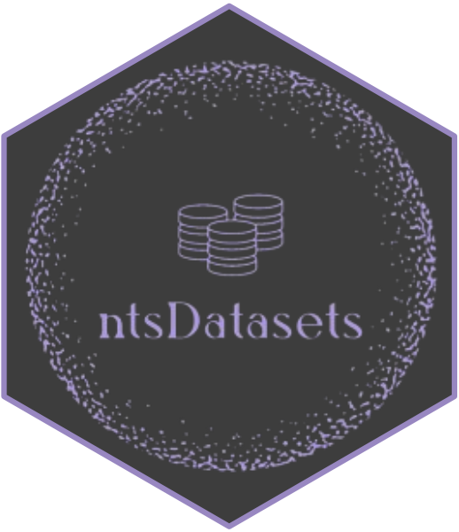

# ntsDatasets 

[](https://github.com/a-roshani/ntsDatasets/actions/workflows/R-CMD-check.yaml)
[](https://cran.r-project.org/package=ntsDatasets)
[](https://cran.r-project.org/package=ntsDatasets)
[](https://cran.r-project.org/package=ntsDatasets)
[](https://www.gnu.org/licenses/gpl-3.0.en.html)

The R package *ntsDatasets* provides a collection of datasets related to neutrosophic sets for statistical modeling and analysis.

This work is funded by national funds through the FCT - Fundação para a
Ciência e a Tecnologia, I.P., under the scope of the projects
UIDB/00297/2020 and UIDP/00297/2020 (Center for Mathematics and
Applications)".

## Installation

You can install the **stable** version from
[CRAN](https://cran.r-project.org/package=ntsDatasets).

``` s
install.packages('ntsDatasets', dependencies = TRUE)
```

You can install the **development** version from
[Github](https://github.com/a-roshani/ntsDatasets)

``` s
# install.packages("remotes")
remotes::install_github("a-roshani/ntsDatasets")
```

## To cite package `ntsDatasets` in publications use:

Roshani, A., Norouzirad, M. Mazarei, D. (2024). *ntsDatasets:
Neutrosophic Data Sets*. R package version 0.1.0,
<https://cran.r-project.org/package=ntsDatasets>.

A BibTeX entry for LaTeX users is

@Manual{ntsDatasets, title = {ntsDatasets: Neutrosophic Data Sets},
author = {Roshani, A. and  Norouzirad, M. and Mazarei, D.}, year = {2024}, note = {R package version 0.1.0}, url =
{<https://cran.r-project.org/package=ntsDatasets>} }

## License

This package is free and open source software, licensed under GPL-3.
